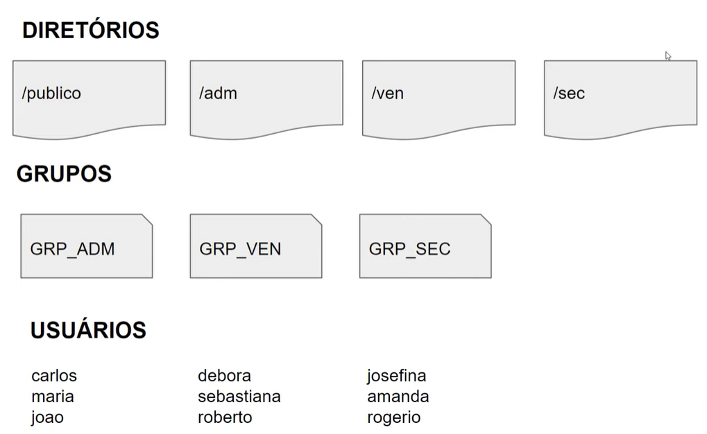

#     Linux-Experience   |   

### Repositório para arquivos de script  do curso **Linux Experience DIO** :penguin:
Mentor: **Denilson Bonatti**

## <a href="scripts/script-iac.sh"> Projeto 1 : Script para IaC - Criação dos Diretórios, Grupos e Usuários </a>

Neste projeto iremos criar um script onde toda a infraestrutura de usuários, grupos de usuários, diretórios e permissões serão criadas automaticamente. Será realizado o upload do arquivo de script no GitHub para futuras reutilizações do script. Sendo assim, toda nova máquina virtual que for iniciada já estará pronta para uso quando o script for executado.
Criação de Script para provisionamento de Infraestrutua com os seguintes requisitos:

**Definições:**
- Todo provisionamento deve ser feito em um arquivo do tipo Bash Script;
- O dono de todos os diretórios criados será o usuário root;
- Todos os usuários terão permissão total dentro do diretório publico;
- Os usuários de cada grupo terão permissão total dentro de seu respectivo diretório;
- Os usuários não poderão ter permissão de leitura, escrita e execução em diretórios de departamentos que eles não pertencem;
- Subir arquivo de script criado para a sua conta no GitHub.

Link para o Script:<a href="scripts/script-iac.sh"> :link:</a> 

## <a href="scripts/script-iac-servidor-web.sh"> Projeto 2 : IaC - Script de provisionamento de um Servidor Web (Apache) </a>

Neste projeto iremos criar um script onde será provisionado um servidor web automaticamente. Um servidor web é um software e hardware que usa HTTP (Hypertext Transfer Protocol) e outros protocolos para responder a solicitações de clientes feitas pela World Wide Web. O principal trabalho de um servidor da web é exibir o conteúdo do site por meio do armazenamento, processamento e entrega de páginas da web aos usuários.

**Definições:**
- Todo provisionamento deve ser feito em um arquivo do tipo Bash Script;
- Atualizar o servidor;
- Instalar o apache2;
- Instalar o unzip;
- Baixar a aplicação disponível no endereço https://github.com/denilsonbonatti/linux-site-dio/archive/refs/heads/main.zip no diretório /tmp;
- Copiar os arquivos da aplicação no diretório padrão do apache;
- Subir arquivo de script para um repositório no GitHub.

Link para o Script:<a href="scripts/script-iac-servidor-web.sh"> :link:</a> 
